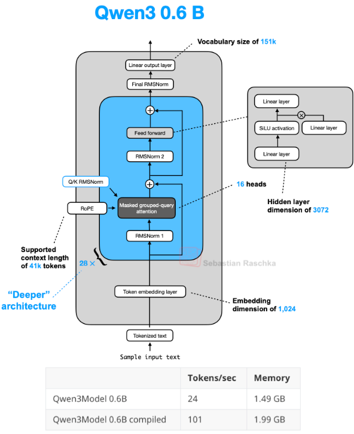

# llm-from-scratch-pytorch

A minimal implementation of a large language model (LLM) from scratch in PyTorch.

The implementation was tested on the model Qwen3-0.6B.


This repo is a replication of Qwen3-0.6B model : https://huggingface.co/Qwen/Qwen3-0.6B

The architechture of the model was studied the code present in the transformers library : https://github.com/huggingface/transformers/tree/main/src/transformers/models/qwen3


Making this repo tought me how to do Rotary Positional Embeddings (RoPE), Flash Attention, and Group Query Attention (GQA).
These are some of the notions that were not tackled in the "Attention is all you need" paper.


## Installation

```bash
pip install -r requirements.txt
```
## Usage

```python
python main.py
```